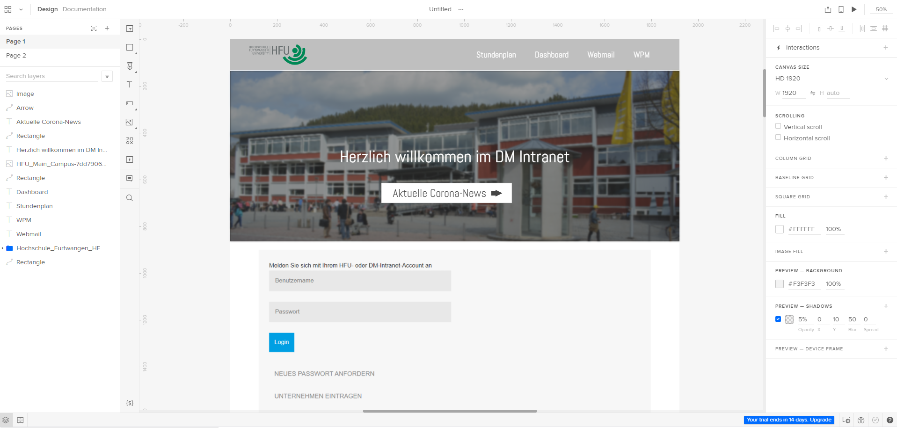

# 2.1 Prototyping-Tool
Niklas Klein

### Allgemeine Beschreibung: was zeichnet das Werkzeug aus, was sind die Kernfeatures?

## Fidelity: für welchen Reifegrad der (a) Interaktivität, (b) Visualisierung und (c) Inhaltsentwicklung eigenet sich das Tool

## Komplexität: wie schätzen Sie das Werkzeug hinsichtlich seiner Komplexität ein. Welche Vorerfahrung muss man mitbringen, um es nutzen zu können?

## Beispiele: zeigen oder verlinken Sie Prototypen, die mit diesem Tool entstanden sind.

## Grenzen: nennen Sie Einschränkungen des Tools.