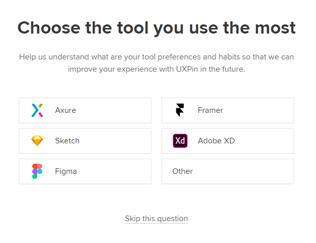
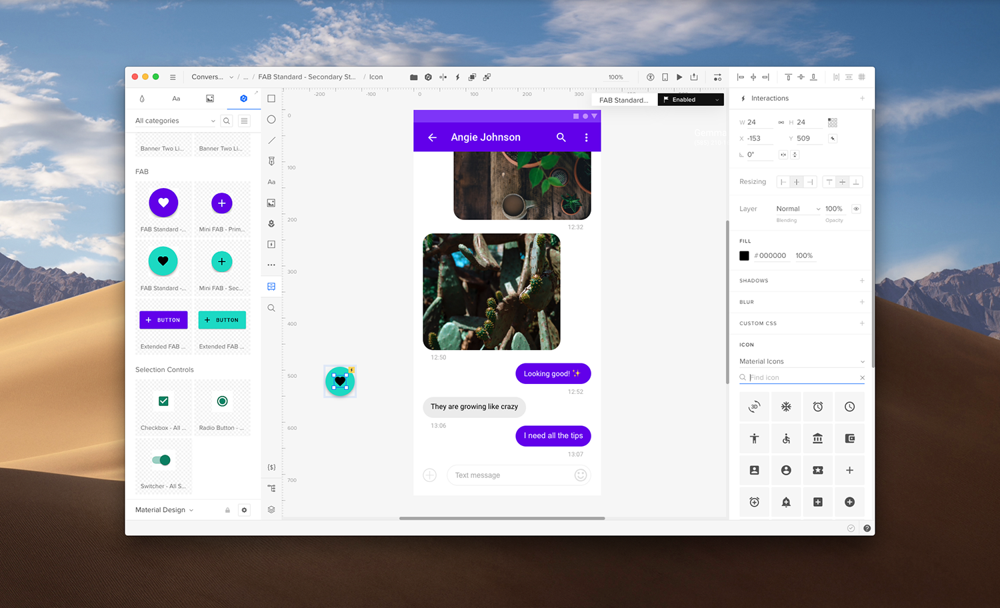

# 2.1 Prototyping-Tool "UXPin"
Niklas Klein

### Allgemeine Beschreibung: was zeichnet das Werkzeug aus, was sind die Kernfeatures?
UXPin ist ein webbasiertes Prototyping-Tool und somit ohne großes herunterladen einfach im Browser zu bedienen. Der große Vorteil dabei: Es ist gut und einfach möglich gemeinsam an einem Projekt zu arbeiten. 

### Fidelity: für welchen Reifegrad der (a) Interaktivität, (b) Visualisierung und (c) Inhaltsentwicklung eigenet sich das Tool
a) Interaktivität: Bei der Interaktivität ist das Prototyping-Tool im mittleren Breiech unterwegs. Es lassen sich mehrere Seiten anlegen und untereinander verknüpfen. Außerdem ist es möglich weitere Interaktionen (Hide, Show, Toogle, ScrollTo, usw.) mit den Schaltflächen zu kombinieren. Auch Formulare lassen sich sehr gut prototypen, da entsprechende Vorlagen verfügbar sind. Bei einfachen Klick-Dummies bleibt es aber dann auch. Wirkliche vielschichte Interaktionen mit Übergängen und Effekten sind in diesem Tool nicht möglich. Um die Interaktivität zu demonstrieren gibt es einen Preview-Modus in dem alle zuvor eingestellten Interaktionen klickbar werden. 

b) Visualisierung: Mit diesem Tool lassen sich sehr hochwertige Visualisierungen ermöglichen. Auf der linken Seite ist eine Layer-Übersicht welche sehr leicht zu bedienen ist. Direkt im Anschluss befinden sich die Bausteine welche sehr übersichtlich strukturiert dargestellt sind und viele Möglichkeiten der Gestaltung zulassen. In der Mitte sieht man seinen Projektfortschritt, hier lässt sich schnell ein Design aufbauen und Inhalt einfügen. Über Drag-Drop ist es auch einfach möglich Bilder einzubauen. Auf der rechten Seite finden sich dann die unzähöigen Einstellungsmöglichkeiten über Größe, Scroll-Richtung, Farbeinstellungen bis hin zur Schriftart. Ein weiteres sehr gutes Feature ist die möglichkeit im Designmonitor direkt mit Grids zu arbeiten. Außerdem lassen sich in der kostenpflichtigen Version auch bereits erstellte Designs aus Photoshop direkt (inklusive aller Layer) einfügen.

c) Inhaltsentwicklung: Die Inhaltsentwicklung hat keinen hohen Stellenwert in diesem Tool. Inhalte können natürlich selbsständig eingefügt werden aber es gibt keine Möglichleit bereits vorentwickelte Inhaltsvorlagen zu nutzen oder den Prototyp mit Inhaltsdateien zu verknüpfen.

### Komplexität: wie schätzen Sie das Werkzeug hinsichtlich seiner Komplexität ein. Welche Vorerfahrung muss man mitbringen, um es nutzen zu können?
Das Programm ist sehr einfach aufgebaut und lässt sich auch für Laien sehr schnell verstehen. Natürlich ist es sinnvoll bereits mit einem UX-Programm gearbeitet zu haben da man so in sehr schneller Zeit mit dem Programm zurecht kommt. Vor allem auch weil das Programm vorab eine Abfrage stellt mit welchen Produkt man bisher gearbeitet hat und das Overlay dann an diese Vorerfahrung anpasst.

Abgesehen davon ist das Programm meiner Meinung nach sehr vielschichtig gerade außerhalb des eingentlichen Bearbeitungsbereichs. Hier ist es denke ich nötig einiges an Zeit hineinzustecken um die vielen Möglichkeiten des Programms wirklich auch vollends nutzen zu können.

### Beispiele: zeigen oder verlinken Sie Prototypen, die mit diesem Tool entstanden sind.
Ich habe nicht wirklich viele Beispiele gefunden, das hier ist eine Review des Programms:

<a href="https://www.interaction-design.org/literature/article/a-review-of-uxpin-a-collaborative-ux-design-tool" target="blank">A Review of UXPin – A Collaborative UX Design Tool</a>

### Grenzen: nennen Sie Einschränkungen des Tools.
Grenzen sind auf jeden Fall im Bereich des finanziellen gezogen. Es gibt eine 14-tägige Testversion, anschließend kostet das Programm aber in der Basisversion mindestes 16€ im Monat. Wer weitere Feautures haben will muss dann auch schnell nochmal eingies an Geld drauf legen. Außerdem gibt es nach meinem ersichten keine Versionskontrolle, was beim gemeinsamen arbeiten an einem POrojekt schnell zu Problemen führen kann. 